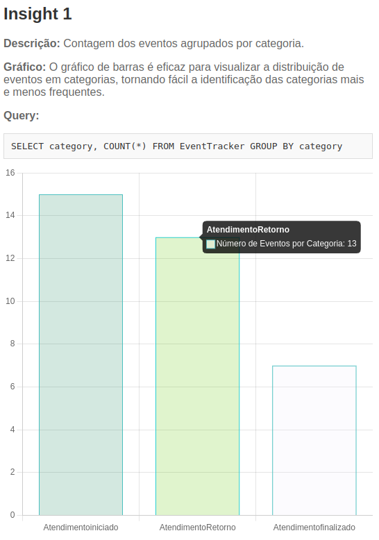
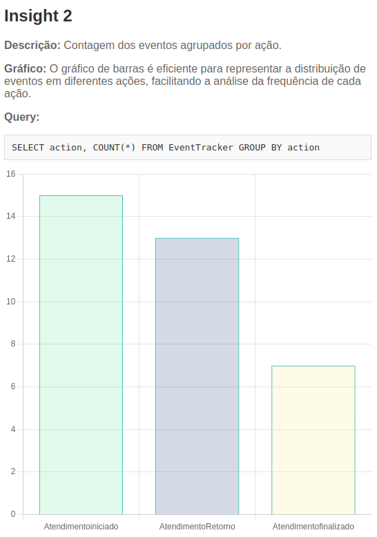
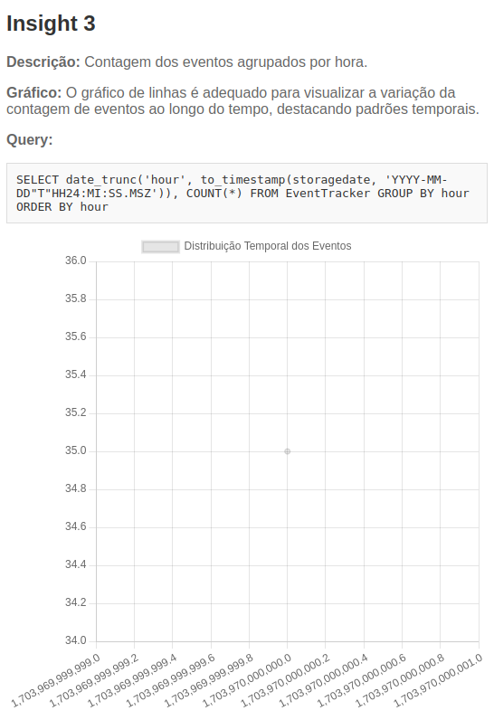
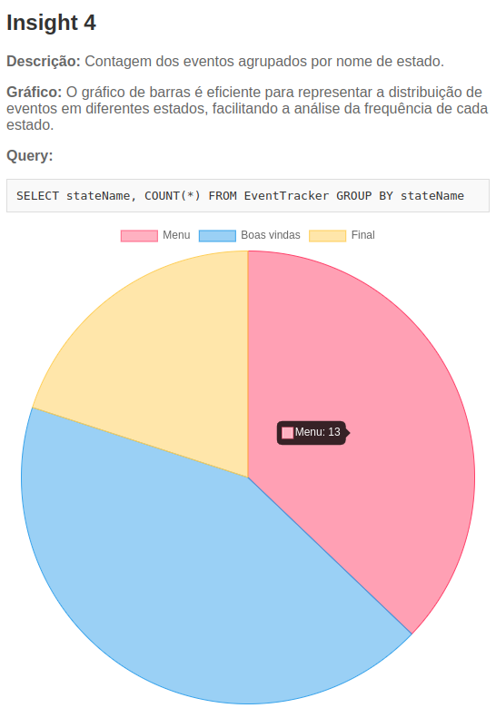
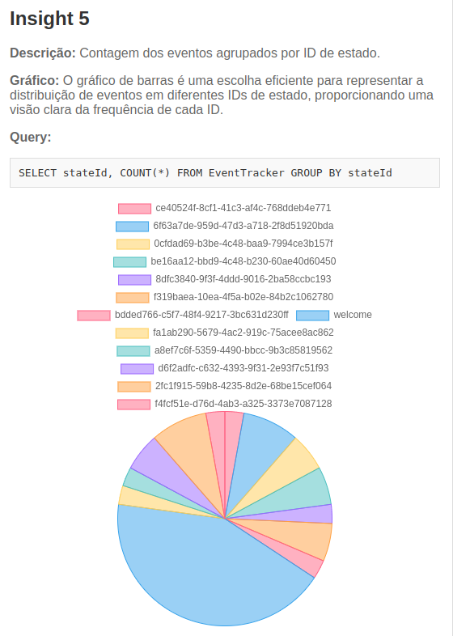
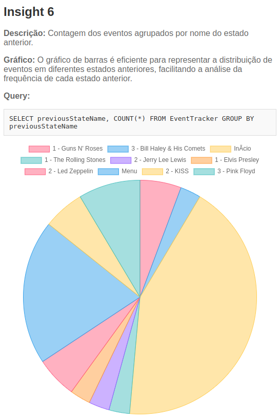

## Cenário Geral

### Objetivo do Projeto
O projeto tem como objetivo recuperar dados de eventos do chat Blip e realizar análises desses dados para proporcionar insights sobre a interação dos usuários. Utiliza-se o Blip Builder para a construção do chat, e os eventos capturados incluem informações como categoria, ação, nome do estado, ID do estado, ID único da mensagem e estado anterior.

### Processo de Captura de Dados
A captura dos eventos do Blip ocorre periodicamente, sendo executada a cada minuto por meio do método `fetchDataPeriodically` na classe `BlipApiService`. Esse processo salva os eventos no banco de dados PostgreSQL para posterior análise.

## Arquitetura

### Tecnologias e Metodologias Utilizadas

- **Java com Spring Boot:** Utilizado para a construção do backend da aplicação, oferecendo uma estrutura robusta e eficiente.
- **PostgreSQL:** Banco de dados relacional utilizado para armazenar os eventos capturados.
- **Docker:** Utilizado para containerizar a aplicação e o banco de dados, facilitando o gerenciamento de dependências e a implantação.
- **MVC (Model-View-Controller):** O padrão arquitetural Model-View-Controller (MVC) é uma abordagem que divide uma aplicação em três componentes principais para melhorar a organização do código, reusabilidade e manutenção. Cada componente tem uma responsabilidade específica:

1. **Model (Modelo):** Representa o estado e a lógica de negócios da aplicação. É responsável por acessar e gerenciar os dados.

2. **View (Visão):** Responsável por apresentar as informações ao usuário e por receber entradas. A View não contém lógica de negócios, apenas exibe dados formatados.

3. **Controller (Controlador):** Atua como intermediário entre o Model e a View. Recebe entradas do usuário, atualiza o Model conforme necessário e atualiza a View para refletir as mudanças no Model.

## MVC no Projeto

### Estrutura

- **`controller`:** Contém as classes responsáveis por receber requisições, interagir com o Model e atualizar a View. No projeto, temos `BlipController` e `InsightController`.

- **`model`:** Contém as classes que representam o Model da aplicação. No projeto, a classe `EventTracker` é um exemplo.

- **`repository`:** Responsável pela comunicação com o banco de dados. No projeto, `EventTrackerRepository` interage com a tabela `eventtracker` no banco de dados.

- **`service`:** Contém classes de serviço que encapsulam a lógica de negócios e interagem com o Model. `BlipApiService` e `InsigthService` são exemplos.

- **`resources`:** Contém arquivos de configuração, scripts SQL, arquivos estáticos (como JavaScript) e templates HTML.

### Fluxo de Execução

1. **Requisição do Usuário:**
   - Quando um usuário faz uma requisição, como acessar uma página ou executar uma análise, o controlador correspondente recebe a requisição.

2. **Processamento do Controlador:**
   - O controlador (por exemplo, `BlipController` ou `InsightController`) processa a requisição, interage com os serviços e atualiza o Model conforme necessário.

3. **Serviços e Repositórios:**
   - Os serviços (`BlipApiService` e `InsigthService`) encapsulam a lógica de negócios. Eles podem interagir com os repositórios para acessar ou modificar dados no banco de dados.

4. **Atualização do Model:**
   - O Model (representado pelos objetos Java, como `EventTracker`) é atualizado pelos serviços com base na lógica de negócios.

5. **Atualização da View:**
   - Após atualizar o Model, o controlador decide como essas mudanças serão refletidas na View. Isso pode envolver a seleção de um template HTML específico ou a preparação de dados para uma resposta JSON.

6. **Resposta ao Usuário:**
   - A resposta final é enviada de volta ao usuário, seja como uma página HTML renderizada ou como dados JSON para serem processados por um frontend.

### Benefícios do MVC no Projeto

1. **Separação de Responsabilidades:**
   - Cada componente (Model, View, Controller) tem uma função clara, facilitando a compreensão do código e a manutenção.

2. **Reusabilidade:**
   - Os modelos de dados (Model) podem ser reutilizados em diferentes partes da aplicação. O mesmo vale para as lógicas de negócios encapsuladas nos serviços.

3. **Manutenção Simplificada:**
   - A divisão clara de responsabilidades facilita a identificação e correção de problemas, bem como a adição de novos recursos sem afetar outras partes da aplicação.

4. **Facilidade de Testes:**
   - Cada componente pode ser testado independentemente, facilitando a criação de testes unitários e garantindo a robustez do código.

5. **Flexibilidade:**
   - Mudanças na lógica de negócios podem ser feitas nos serviços sem afetar diretamente a apresentação na View.

6. **Integração com o Banco de Dados:**
   - O uso de repositórios para interagir com o banco de dados facilita a manutenção e evolução do sistema.


## Estrutura de Diretórios

```
├── README.md
├── docker-compose.yml
├── docs
│   └── images
└── server
    ├── Dockerfile
    ├── pom.xml
    ├── src
    │   └── main
    │       ├── java
    │       │   └── br
    │       │       └── blip
    │       │           ├── BlipApplication.java
    │       │           ├── config
    │       │           │   ├── AppConfig.java
    │       │           │   ├── SecurityConfig.java
    │       │           │   ├── SwaggerConfig.java
    │       │           │   └── WebConfig.java
    │       │           ├── controller
    │       │           │   ├── BlipController.java
    │       │           │   └── InsightController.java
    │       │           ├── model
    │       │           │   ├── EventTracker.java
    │       │           │   └── dto
    │       │           │       ├── InsightDTO.java
    │       │           │       └── InsightTemporalDTO.java
    │       │           ├── repository
    │       │           │   └── EventTrackerRepository.java
    │       │           └── service
    │       │               ├── BlipApiService.java
    │       │               └── InsigthService.java
    │       ├── main.iml
    │       └── resources
    │           ├── application.properties
    │           ├── db
    │           │   └── migration
    │           │       └── V1_database.sql
    │           ├── static
    │           │   └── js
    │           │       └── chart-scripts.js
    │           └── templates
    │               └── insight-chart.html
```

- **`docker-compose.yml`:** Configuração do Docker Compose para orquestração de contêineres.
- **`server`:** Pasta contendo o código-fonte da aplicação Spring Boot.
  - **`Dockerfile`:** Configurações para a criação da imagem Docker da aplicação.
  - **`pom.xml`:** Configurações do Maven para a construção do projeto.
  - **`src`:** Código-fonte da aplicação.
    - **`java`:** Pacotes Java contendo classes da aplicação.
    - **`resources`:** Recursos da aplicação, como arquivos de configuração e scripts SQL.
      - **`db/migration`:** Scripts de migração do banco de dados.
      - **`static/js`:** Scripts JavaScript, incluindo o `chart-scripts.js`.
      - **`templates`:** Arquivos HTML, incluindo o `insight-chart.html`.

## Requerimentos

Para iniciar o ambiente, é necessário ter o Docker instalado. Utilize o seguinte comando:

```bash
docker-compose down -v && docker-compose up --force-recreate --build -d --remove-orphans
```

### Serviços Docker Compose

- **db (PostgreSQL):**
  - **Host:** localhost
  - **Porta:** 5432
  - **Usuário:** db_user
  - **Senha:** db_pass
- **app-server (Spring Boot):**
  - **Porta:** 8081
  - **Endpoint:** [http://localhost:8081](http://localhost:8081)
  - **Swagger:** [http://locahost:8081/swagger-ui.html](http://locahost:8081/swagger-ui.html)
  - **Variáveis de Ambiente:**
    - **DATASOURCE_USERNAME:** db_user
    - **DATASOURCE_PASSWORD:** db_pass
    - **DATASOURCE_HOST:** db
    - **PROFILE:** prd
    - **SERVICE_PORT:** 8081
    - **BLIP_KEY:** aGFybW9ueWh1YjE6NUd0eEU4a0JFdE9uRlBPS0NFWXE=

## Database

### Tabela `eventtracker`

```sql
CREATE SCHEMA blip_db;

CREATE TABLE blip_db.eventtracker (
    ownerIdentity     VARCHAR(100) NOT NULL,  
    storageDate       VARCHAR(100) NOT NULL,  
    category          VARCHAR(100) NOT NULL,  
    action            VARCHAR(100) NOT NULL, 
    stateName         VARCHAR(100) NOT NULL,  
    stateId           VARCHAR(100) NOT NULL,  
    messageId         VARCHAR(100) NOT NULL PRIMARY KEY, 
    previousStateId   VARCHAR(100) NOT NULL, 
    previousStateName VARCHAR(100) NOT NULL
);

COMMENT ON COLUMN blip_db.eventtracker.ownerIdentity IS 'Identidade do proprietário';
COMMENT ON COLUMN blip_db.eventtracker.storageDate IS 'Data de armazenamento do evento';
COMMENT ON COLUMN blip_db.eventtracker.category IS 'Categoria do evento';
COMMENT ON COLUMN blip_db.eventtracker.action IS 'Ação associada ao evento';
COMMENT ON COLUMN blip_db.eventtracker.stateName IS 'Nome do estado do evento';
COMMENT ON COLUMN blip_db.eventtracker.stateId IS 'Identificador do estado do evento';
COMMENT ON COLUMN blip_db.eventtracker.messageId IS 'Identificador único da mensagem associada ao evento';
COMMENT ON COLUMN blip_db.eventtracker.previousStateId IS 'Identificador do estado anterior ao evento';
COMMENT ON COLUMN blip_db.eventtracker.previousStateName IS 'Nome do estado anterior ao evento';
```

## Endpoints

### `BlipController`

- **`/blip/fetch-and-show` (GET):**
  - **Parâmetros:**
    - `startDate` (Opcional): Data de início no formato 'yyyy-MM-ddTHH:mm:ss'.
    - `endDate` (Opcional): Data de término no formato 'yyyy-MM-ddTHH:mm:ss'.
  - **Retorno:** Lista de eventos do Blip dentro do intervalo de datas especificado.

### `InsightController`

- **`/analises/eventos-por-categoria` (GET):**
  - **Retorno:** Lista de objetos representando a contagem de eventos por categoria.
- **`/analises/eventos-por-acao` (GET):**
  - **Retorno:** Lista de objetos representando a contagem de eventos por ação.
- **`/analises/distribuicao-temporal` (GET):**
  - **Retorno:** Lista de objetos representando a distribuição temporal dos eventos.
- **`/analises/eventos-por-nome-do-estado` (GET):**
  - **Retorno:** Lista de objetos representando a contagem de eventos por nome do estado.
- **`/analises/eventos-por-id-do-estado` (GET):**
  - **Retorno:** Lista de objetos representando a contagem de eventos por ID do estado.
- **`/analises/eventos-por-nome-do-estado-anterior` (GET):**
  - **Retorno:** Lista de objetos representando a contagem de eventos por nome do estado anterior.

## Análises

### Insight 1: Número de Eventos por Categoria

- **Descrição:** Contagem dos eventos agrupados por categoria.
- **Gráfico:** O gráfico de barras é eficaz para visualizar a distribuição de eventos em categorias, tornando fácil a identificação das categorias mais e menos frequentes.
- **Query:**
  ```sql
  SELECT category, COUNT(*) FROM EventTracker GROUP BY category
  ```

### Insight 2: Número de Eventos por Ação

- **Descrição:** Contagem dos eventos agrupados por ação.
- **Gráfico:** O gráfico de barras é eficiente para representar a distribuição de eventos em diferentes ações, facilitando a análise da frequência de cada ação.
- **Query:**
  ```sql
  SELECT action, COUNT(*) FROM EventTracker GROUP BY action
  ```

### Insight 3: Distribuição Temporal dos Eventos

- **Descrição:** Contagem dos eventos agrupados por hora.
- **Gráfico:**  O gráfico de linhas é adequado para visualizar a variação da contagem de eventos ao longo do tempo, destacando padrões temporais.
- **Query:**
  ```sql
  SELECT ndate_trunc('hour', to_timestamp(storagedate, 'YYYY-MM-DD"T"HH24:MI:SS.MSZ')), COUNT(*) FROM EventTracker GROUP BY hour ORDER BY hour
  ```

### Insight 4: Número de Eventos por Nome de Estado

- **Descrição:** Contagem dos eventos agrupados por nome de estado.
- **Gráfico:** O gráfico de barras é eficiente para representar a distribuição de eventos em diferentes estados, facilitando a análise da frequência de cada estado.
- **Query:**
  ```sql
  SELECT stateName, COUNT(*) FROM EventTracker GROUP BY stateName
  ```

### Insight 5: Número de Eventos por ID de Estado

- **Descrição:** Contagem dos eventos agrupados por ID de estado.
- **Gráfico:** O gráfico de barras é uma escolha eficiente para representar a distribuição de eventos em diferentes IDs de estado, proporcionando uma visão clara da frequência de cada ID.
- **Query:**
  ```sql
  SELECT stateId, COUNT(*) FROM EventTracker GROUP BY stateId
  ```

### Insight 6: Número de Eventos por Nome de Estado Anterior

- **Descrição:** Contagem dos eventos agrupados por nome do estado anterior.
- **Gráfico:** O gráfico de barras é eficiente para representar a distribuição de eventos em diferentes estados anteriores, facilitando a análise da frequência de cada estado anterior.
- **Query:**
  ```sql
  SELECT previousStateName, COUNT(*) FROM EventTracker GROUP BY previousStateName
  ```

## Gráficos

### Gráfico 1: Número de Eventos por Categoria



### Gráfico 2: Número de Eventos por Ação



### Gráfico 3: Distribuição Temporal dos Eventos



### Gráfico 4: Número de Eventos por Nome de Estado



### Gráfico 5: Número de Eventos por ID de Estado



### Gráfico 6: Número de Eventos por Nome de Estado Anterior

